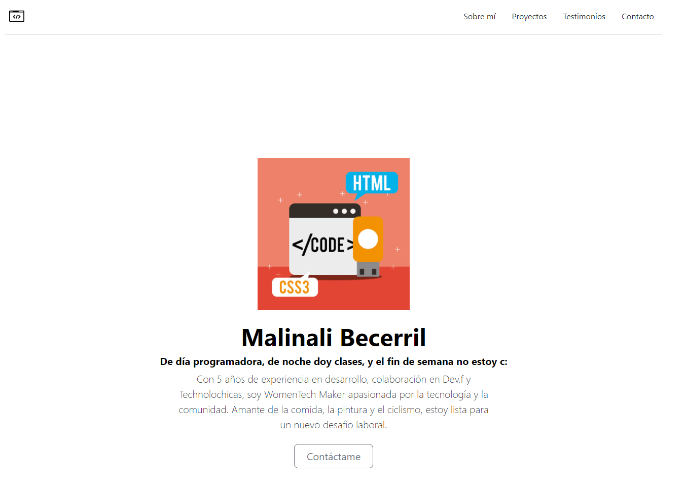

# Portafolio personal: Tecnolochicas PRO

Este proyecto fue creado durante el bootacamp Technolochicas PRO, es una página web responsiva (adptable a diversos dispositivos).

El propósito de la creación de este sitio web es mostrar el portafolio de proyectos de la desarrolladora y su experiencia alrededor del área.

Incluye las secciones: sobre mí, proyectos, experiencia.

Incluye recursos multimedia.

<a href="https://jovial-zuccutto-f60209.netlify.app/" target="_blank">**Visitalo ahora** 🚀</a>
# Secciones (capturas de pantalla)

Sobre mí:

# Tecnologías

## 📬 Contacto

Si estás interesad@ en compartir o conectar para algún proyecto u oportunidad laboral, contáctame.

<a href="https://www.linkedin.com/"></img></a>

© 2023 Malinali (Programa Technolochicas PRO)